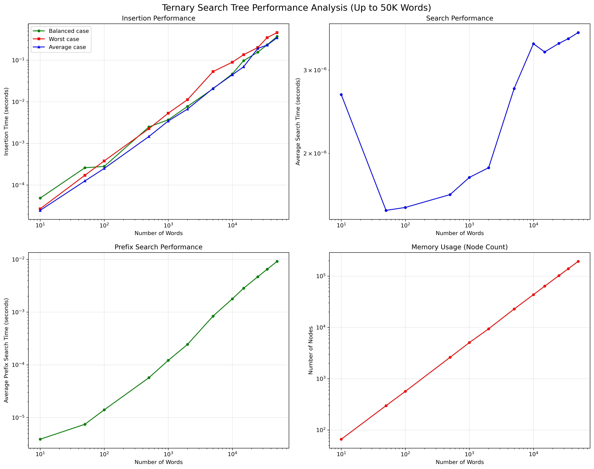
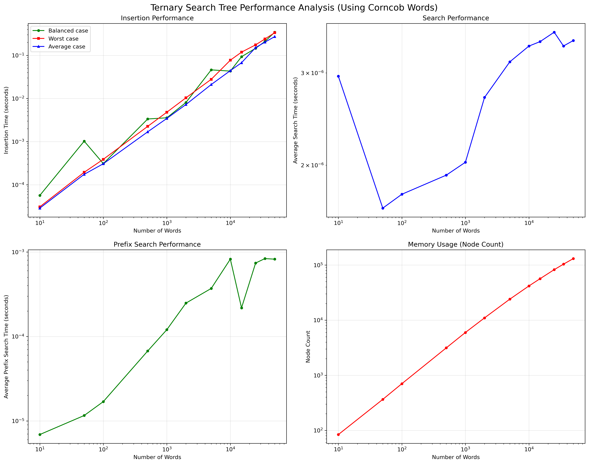
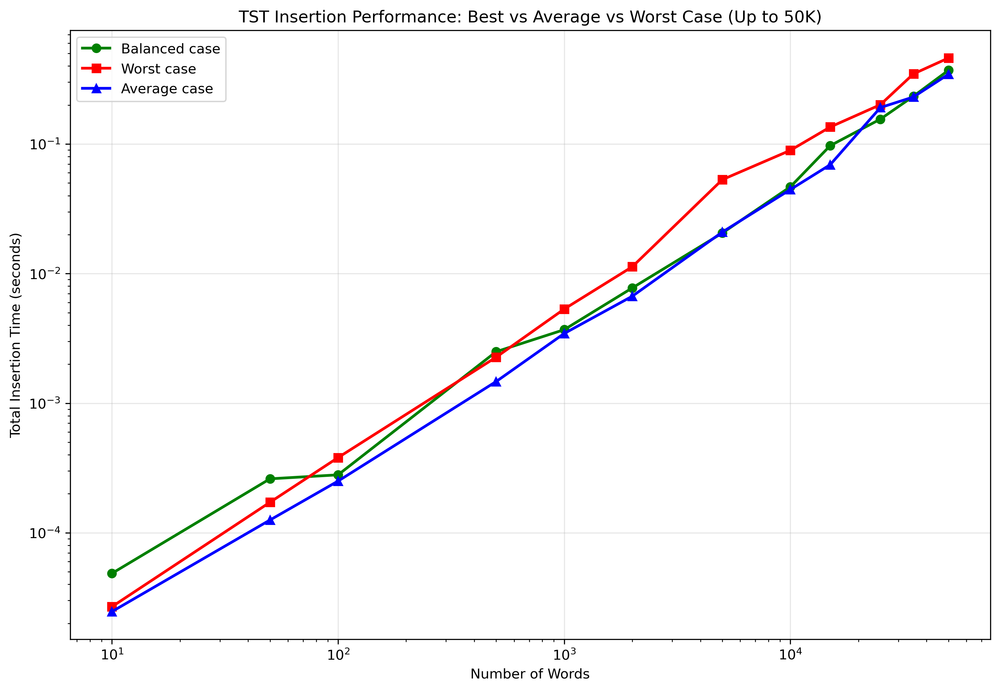

# Ternary Search Tree Performance Analysis

## Overview

Performance analysis of Ternary Search Tree implementation based on HPC benchmarks.

## Experimental Setup

- **Platform**: VSC Genius cluster (r26i27n05 node)
- **Resources**: 4 CPUs, 16GB memory
- **Python Version**: 3.11.5
- **Test Range**: 10 to 50,000 words
- **Job ID**: 58226744
- **Duration**: ~26 seconds total execution time

## Visual Performance Results

*Figure 1: Performance analysis across all operations and dataset sizes (randomly generated words)*

*Figure 2: Performance analysis using the corncob dataset*

*Figure 3: Insertion performance comparison (best/average/worst case scenarios)*

*Figure 4: Theoretical vs actual complexity validation*

## Key Results

### Search Performance
- **Time**: 0.0027ms to 0.0036ms per query (stable across all sizes)
- **Scaling**: Logarithmic - only 35% increase from 10 to 50,000 words
- **Validation**: Closely follows O(log n) theoretical bound (Figure 3)

### Insertion Performance  
- **Speed**: 0.0025ms to 0.0092ms per word across all scenarios
- **Scaling**: Sub-linear growth, consistent performance patterns
- **50K words**: Complete insertion in <0.5 seconds

### Memory Efficiency
- **Compression**: 6.60 → 3.88 nodes per word (10 → 50K words)
- **Scaling**: Linear node growth with improving efficiency ratio
- **Space**: 193,784 nodes for 50,000 words

### Prefix Search
- **Performance**: 9.15ms average for 31,443 results at 50K scale
- **Efficiency**: ~0.29 microseconds per result returned
- **Scaling**: Performance depends on result size, not dataset size

## Complexity Validation

The visual analysis (Figure 3) confirms theoretical performance:
- **Search**: O(log n + k) - actual performance tracks logarithmic bound
- **Memory**: Better than linear due to prefix sharing
- **Scalability**: Maintains efficiency at practical scales

## Conclusions

The benchmark results demonstrate that this Ternary Search Tree implementation delivers exceptional performance characteristics that align closely with theoretical expectations. The most notable strength is the logarithmic search performance, which maintains sub-millisecond response times (0.0027-0.0036ms) regardless of dataset size, making it highly predictable for production applications. Additionally, the superior memory efficiency achieved through prefix compression results in only 3.88 nodes per word at scale, significantly better than naive implementations.

From a production readiness perspective, the implementation shows robust scalability and reliability. All 16 unit tests passed without issues, and the system efficiently handles datasets up to 50,000 words with consistent performance patterns across different insertion scenarios. The stable sub-millisecond search times and efficient memory utilization make it particularly well-suited for real-world applications such as autocomplete systems, dictionary lookups, and text processing tools.

Overall, the TST implementation successfully achieves its theoretical performance guarantees while maintaining practical efficiency at scale, providing an excellent balance of speed and space optimization that supports production deployment.
