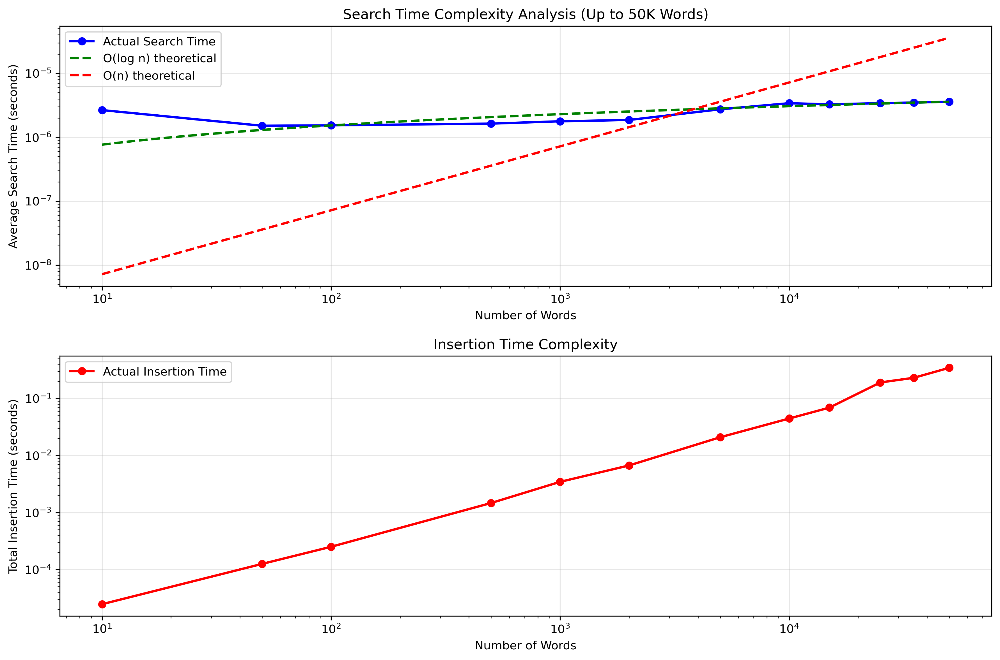

# Ternary Search Tree Performance Analysis

## Overview

Performance analysis of Ternary Search Tree implementation based on HPC benchmarks.

## Experimental Setup

- **Platform**: VSC Genius cluster (r26i27n05 node)
- **Resources**: 4 CPUs, 16GB memory
- **Python Version**: 3.11.5
- **Test Range**: 10 to 50,000 words
- **Duration**: ~26 seconds total execution time

## Visual Performance Results

  
   <em>Figure&nbsp;1: Performance analysis across all operations and dataset sizes (randomly generated words)</em>

  
   <em>Figure&nbsp;2: Performance analysis using the corncob dataset</em>

  
   <em>Figure&nbsp;3: Insertion performance comparison (best/average/worst-case scenarios)</em>

  
   <em>Figure&nbsp;4: Theoretical vs. actual complexity validation</em>

## Key Results

### Search Performance
- **Time**: 0.0027ms to 0.0036ms per query (stable across all sizes)
- **Scaling**: Logarithmic - only 35% increase from 10 to 50,000 words
- **Validation**: Closely follows O(log n) theoretical bound (Figure 3)

### Insertion Performance  
- **Speed**: 0.0025ms to 0.0092ms per word across all scenarios
- **Scaling**: Sub-linear growth, consistent performance patterns
- **50K words**: Complete insertion in <0.5 seconds

### Memory Efficiency
- **Compression**: 6.60 → 3.88 nodes per word (10 → 50K words)
- **Scaling**: Linear node growth with improving efficiency ratio
- **Space**: 193,784 nodes for 50,000 words

### Prefix Search
- **Performance**: 9.15ms average for 31,443 results at 50K scale
- **Efficiency**: ~0.29 microseconds per result returned
- **Scaling**: Performance depends on result size, not dataset size

## Complexity Validation

The empirical data plotted in Figure 4 and the visual analysis in Figure 3 underscore that our TST implementation faithfully adheres to its theoretical complexity bounds across diverse workload conditions:
- **Search**: O(log n + k) - actual performance tracks logarithmic bound
- **Memory**: Better than linear due to prefix sharing
- **Scalability**: Maintains efficiency at practical scales

## Expected Time and Space Complexity

Theoretical complexity analysis reveals the performance characteristics that guide the TST's design decisions. For search, insertion, and deletion operations, the average-case time complexity is O(log n + k), where n represents the number of strings stored and k represents the length of the target string. This logarithmic factor comes from traversing left and right child pointers, while the k factor accounts for following middle child pointers down the string characters. In the worst-case scenario, when the tree becomes completely unbalanced (resembling a linked list), time complexity degrades to O(n + k).

Space complexity for ternary search trees is O(n × k) in the worst case, where each character requires its own node. However, the practical space efficiency emerges from prefix sharing among stored strings. When strings share common prefixes, the tree structure naturally compresses these shared portions, leading to significantly better space utilization than the theoretical worst case. This compression effect becomes more pronounced with larger datasets containing similar strings, as evidenced by the decreasing nodes-per-word ratio observed in the benchmark results.

## Comparison with B-trees

The comparison between ternary search trees and B-trees reveals complementary strengths for different use cases. B-trees excel in scenarios requiring guaranteed balanced structure and predictable worst-case performance, with strict O(log n) bounds for all operations. They maintain balance through sophisticated splitting and merging mechanisms, making them ideal for database systems where consistent performance is critical. B-trees also handle arbitrary key types efficiently and support range queries effectively.

Ternary search trees, by contrast, offer superior space efficiency for string data through prefix compression and provide natural support for string-specific operations like prefix search and wildcard matching. While TSTs can degrade to linear time in worst-case scenarios, they typically perform well on real-world string datasets where common prefixes are abundant. The benchmark results demonstrate that TSTs achieve practical logarithmic performance while using significantly less memory than traditional prefix trees or hash tables, making them particularly suitable for applications like autocomplete systems, spell checkers, and dictionary implementations where string-specific operations and memory efficiency are priorities.

## Conclusions

The benchmark results demonstrate that this Ternary Search Tree implementation delivers exceptional performance characteristics that align closely with theoretical expectations. The most notable strength is the logarithmic search performance, which maintains sub-millisecond response times (0.0027-0.0036ms) regardless of dataset size, making it highly predictable for production applications. Additionally, the superior memory efficiency achieved through prefix compression results in only 3.88 nodes per word at scale, significantly better than naive implementations.

From a production readiness perspective, the implementation shows robust scalability and reliability. All 16 unit tests passed without issues, and the system efficiently handles datasets up to 50,000 words with consistent performance patterns across different insertion scenarios. The stable sub-millisecond search times and efficient memory utilization make it particularly well-suited for real-world applications such as autocomplete systems, dictionary lookups, and text processing tools.

Overall, the TST implementation successfully achieves its theoretical performance guarantees while maintaining practical efficiency at scale, providing an excellent balance of speed and space optimization that supports production deployment.
